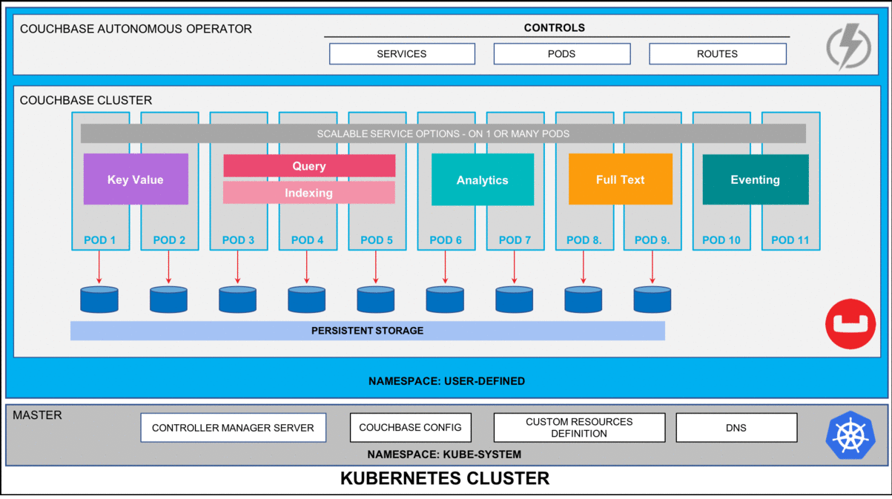
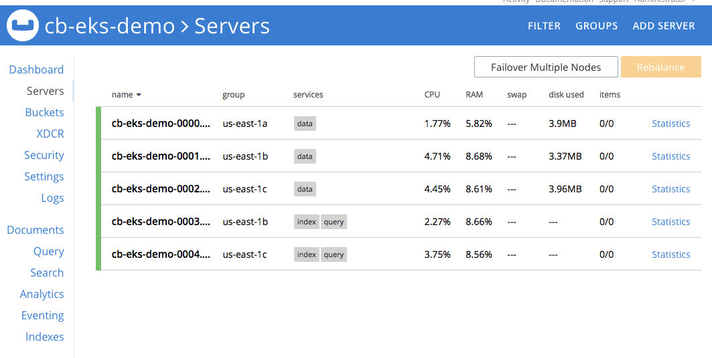

# Deploy self-healing, highly-available Couchbase cluster on Kubernetes using Persistent Volumes


## Prologue
Modern business applications are expected to be up 24/7, even during the planned rollout of new features and periodic patching of Operating System or application. Achieving this feat requires tools and technologies that ensure the speed of development, infrastructure stability and ability to scale.

Container orchestration tools like Kubernetes is revolutionizing the way applications are being developed and deployed today by abstracting away the physical machines it manages. With Kubernetes, you can describe the amount of memory, compute power you want, and have it available without worrying about the underlying infrastructure.

Pods (unit of computing resource) and containers (where the applications are run) in Kubernetes environment can self-heal in the event of any type of failure. They are, in essence, ephemeral. This works just fine when you have a stateless microservice but applications that require their state maintained for example database management systems like Couchbase, you need to be able to externalize the storage from the lifecycle management of Pods & Containers so that the data can be recovered quickly by simply remounting the storage volumes to a newly elected Pod.

This is what [Persistent Volumes](https://kubernetes.io/docs/concepts/storage/persistent-volumes/) enables in Kubernetes based deployments. [Couchbase Autonomous Operator](https://docs.couchbase.com/operator/current/overview.html) is one of the first adopters of this technology to make recovery from any infrastructure-based failure seamless and most importantly faster.

In this article we will take a step-by-step look at how you can deploy Couchbase cluster on Google Kurnetes engine (GKE): 1) using multiple Couchbase server groups that can be mapped to a separate availability zone for high availability 2) leverage persistent volumes for fast recovery from infrastructure failure.



Figure 1: Couchbase Autonomous Operator for Kubernetes self-monitors and self-heals Couchbase database platform.

## Prerequisites
There are three high-level prerequisites before we begin the deployment of Couchbase Autonomous Operator on GKE:

**HERE CHANGE ------------------**

1. You have kubectl installed on our local machine.
2. Latest GKE CLI is configured so that we can securely establish a channel between our local machine and the Kubernetes control plane running on AWS.
3. Google Kubernetes cluster is deployed with at least three worker nodes in three separate availability zones so we can later deploy and manage our Couchbase cluster. We will be using us-east-1 as the region and us-east-1a/1b/1c as three availability-zones but you can deploy to any region/zones by making minor changes to YAML files in the examples below.

Run ‘kubectl get nodes’ command from the local machine to confirm GKE cluster is up and running.

```console
$ kubectl get nodes

NAME                                       STATUS    ROLES     AGE       VERSION
ip-192-168-xx.us-east-2.compute.internal   Ready     &lt;none>    10m       v1.11.5
ip-192-168-yy.us-east-2.compute.internal   Ready     &lt;none>    10m       v1.11.5
ip-192-168-zz.us-east-2.compute.internal   Ready     &lt;none>    10m       v1.11.5
```

## Deploy Couchbase Autonomous Operator

Once we have tested that we can connect to Kubernetes control plane running on Amazon EKS cluster from our local machine, we can now begin with the steps required to deploy Couchbase Autonomous Operator, which is the glue technology enabling Couchbase Server cluster to be managed by Kubernetes.

### 1) Download Operator package
Let’s first begin by downloading the latest Couchbase Autonomous Operator and unzip onto the local machine. Change directory to the operator folder so we can find YAML files we need to deploy Couchbase operator:

```console
$ cd couchbase-autonomous-operator-kubernetes_1.1.0-541_macos-x86_64
$ ls
```

output:

```console
License.txt     pvc.yaml
README.txt      couchbase-cluster.yaml
aws-auth-cm.yaml        secret.yaml
aws-auth-patch.yaml crd.yaml
bin         cluster-role.yaml
couchbase-cli-create-user.yaml  operator.yaml
```
 
### 2) Create a namespace

Create a namespace that will allow cluster resources to be nicely separated between multiple users. To do that we will use a unique namespace called emart for our deployment and later will use this namespace to deploy Couchbase Cluster.

In your working directory create a namespace.yaml file with this content and save it in the Couchbase operator directory itself:

```file
apiVersion: v1
kind: Namespace
metadata:
  name: emart
```

After saving the namespace configuration in a file, run kubectl cmd to create it:

```console
$ kubectl create -f namespace.yaml

$ kubectl create -f namespace.yaml
```

Run get namespace command to confirm it is created successfully:

```console
$ kubectl get namespaces

output:

NAME          STATUS    AGE
default       Active    1h
emart       Active    12s
```

From now onwards we will use **_emart_** as the namespace for all resource provisioning.

### 3) Create a Cluster Role

Next, we will create a cluster role that allows the Operator to access the resources that it needs to run. Since the Operator will manage many different namespaces, it is best to create a cluster role first because you can assign that role to a service account in any namespace.

To create the cluster role for the Operator, run the following command:

```console
$ kubectl create -f cluster-role.yaml
```

This cluster role only needs to be created once.

### 4) Create a Service Account
After the cluster role is created, you need to create a service account in the namespace where you are installing the Operator. To create the service account:

```console
$ kubectl create serviceaccount couchbase-operator --namespace emart
```

Now assign the cluster role to the service account:

```console
$ kubectl create clusterrolebinding couchbase-operator --clusterrole couchbase-operator  --serviceaccount emart:couchbase-operator

output:

clusterrolebinding.rbac.authorization.k8s.io/couchbase-operator created
```

### 5) Create Secret for Couchbase Admin Console

Next create a secret credential which will be used by the administrative web console during login. For convenience, a sample secret is provided in the Operator package. When you push it to your Kubernetes cluster, the secret sets the username to **Administrator** and the password to **password**.

To push the secret into your Kubernetes cluster, run the following command:

```console
$ kubectl create -f secret.yaml --namespace emart

Output:

Secret/cb-example-auth created
```

### 6) Deploy Couchbase Operator
We now have all the roles and privileges for our operator to be deployed. Deploying the operator is as simple as running the operator.yaml file from the Couchbase Autonomous Operator directory.

```
$ kubectl create -f operator.yaml --namespace emart

output:

deployment.apps/couchbase-operator created
```

Above command will download the Operator Docker image (specified in the operator.yaml file) and creates a [deployment](https://kubernetes.io/docs/concepts/workloads/controllers/deployment/), which manages a single instance of the Operator. The Operator uses a deployment so that it can restart if the pod it’s running in dies.

It would take less than a minute for Kubernetes to deploy the Operator and for the Operator to be ready to run.

#### a) Verify the Status of the Deployment
You can use the following command to check on the status of the deployment:
```console
  $ kubectl get deployments --namespace emart
```

If you run the this command immediately after the Operator is deployed, the output will look something like the following:
```console
NAME         DESIRED    CURRENT     UP-TO-DATE      AVAILABLE       AGE
cb-operator   1          1          1               0               10s
```

**Note:** Above output means your Couchbase operator is deployed and you can go ahead with deploying Couchbase cluster next.

#### b) Verify the Status of the Operator
You can use the following command to verify that the Operator has started successfully:
```
$ kubectl get pods --namespace emart
```

If the Operator is up and running, the command returns an output where the READY field shows 1/1, such as:
```
NAME                                    READY   STATUS   RESTARTS   AGE
couchbase-operator-8c554cbc7-6vqgf      1/1         Running  0          57s
```

You can also check the logs to confirm that the Operator is up and running. Look for the message: CRD initialized, listening for events…​ module=controller.

```
$ kubectl logs couchbase-operator-8c554cbc7-6vqgf --namespace emart --tail 20

output:

kubectl time="2019-01-30T19:50:09Z" level=info msg="couchbase-operator v1.1.0 (release)" module=main
time="2019-01-30T19:50:09Z" level=info msg="Obtaining resource lock" module=main
time="2019-01-30T19:50:09Z" level=info msg="Starting event recorder" module=main
time="2019-01-30T19:50:09Z" level=info msg="Attempting to be elected the couchbase-operator leader" module=main
time="2019-01-30T19:50:09Z" level=info msg="I'm the leader, attempt to start the operator" module=main
time="2019-01-30T19:50:09Z" level=info msg="Creating the couchbase-operator controller" module=main
time="2019-01-30T19:50:09Z" level=info msg="Event(v1.ObjectReference{Kind:\"Endpoints\", Namespace:\"emart\", Name:\"couchbase-operator\", UID:\"3fa5a763-24c8-11e9-840e-0a6089ba2536\", APIVersion:\"v1\", ResourceVersion:\"8306\", FieldPath:\"\"}): type: 'Normal' reason: 'LeaderElection' couchbase-operator-8c554cbc7-6vqgf became leader" module=event_recorder
time="2019-01-30T19:50:14Z" level=info msg="CRD initialized, listening for events..." module=controller
time="2019-01-30T19:50:14Z" level=info msg="starting couchbaseclusters controller"
```

## Deploy Couchbase cluster using persistent volumes

In a production environment where performance and SLA of the system matters most, we should always plan on deploying Couchbase cluster using persistent volumes because it helps in:

* **Data Recoverability**: Persistent Volumes allow the data associated within Pods to be recovered in the case that a Pod is terminated. This helps prevent data-loss and avoid time-consuming index building when using the data or index services.
* **Pod Relocation**: Kubernetes may decide to evict pods that reach resource thresholds such as CPU and Memory Limits. Pods that are backed with Persistent Volumes can be terminated and restarted on different nodes without incurring any downtime or data-loss.
* **Dynamic Provisioning**: The Operator will create Persistent Volumes on-demand as your cluster scales, alleviating the need to pre-provision your cluster storage prior to deployment.
* **Cloud Integration**: Kubernetes integrates with native storage provisioners available on major cloud vendors such as AWS and GCE.

In this next section we will see how you can define storage classes in different availability zone and build persistent volume claim template, which will be used in **_couchbase-cluster.yaml_** file.

### 1) Create AWS storage class for the EKS cluster
In order to use **PersistentVolume** for Couchbase services (data, index, search, etc.), we need to create [Storage Classes](https://kubernetes.io/docs/concepts/storage/storage-classes) (SC) first in each of the Availability Zones (AZ). Let’s begin by checking what storage classes exist in our environment.

Let’s use kubectl command to find that out:

```
$ kubectl get storageclass 

Output: 

gp2 (default)   kubernetes.io/aws-ebs   12m
```

Above output means we just have default _gp2_ storage class and we need to create separate storage-classes in all of the AZs where we are planning to deploy our Couchbase cluster.

We will run below steps to create three different storage classes of type gp2 in three separate availability zones. As we will be deploying our cluster in **_us-east-1_** region so we will be picking three different AZs (**_us-east-1a/1b/1c_**) in this region only.

1. Create an AWS storage class manifest file for your storage class. Below example defines a storage class that uses the Amazon EBS gp2 volume type. For more information about the options available for AWS storage classes, see AWS in the Kubernetes documentation.
* Let’s create our first storage definition file [sc-east-1a.yaml](https://github.com/sahnianuj/cb-operator/blob/master/sc-east-1a.yaml) that represent storage class in us-east-1a Availability-Zone (AZ).
``` 
  apiVersion: storage.k8s.io/v1
  kind: StorageClass
  metadata:
    labels:
      k8s-addon: storage-aws.addons.k8s.io
    name: sc-us-east-1a
  parameters:
    type: gp2
    zone: us-east-1a
  provisioner: kubernetes.io/aws-ebs
  reclaimPolicy: Delete
```
* Create second storage definition class sc-[east-1b.yaml](https://github.com/sahnianuj/cb-operator/blob/master/sc-east-1b.yaml) in us-east-1b AZ:
```
  apiVersion: storage.k8s.io/v1
  kind: StorageClass
  metadata:
    labels:
      k8s-addon: storage-aws.addons.k8s.io
    name: sc-us-east-1b
  parameters:
    type: gp2
    zone: us-east-1b
  provisioner: kubernetes.io/aws-ebs
  reclaimPolicy: Delete
```
* Create third storage definition class [sc-east-1c.yaml](https://github.com/sahnianuj/cb-operator/blob/master/sc-east-1c.yaml) in us-east-1c:
```
  apiVersion: storage.k8s.io/v1
  kind: StorageClass
  metadata:
    labels:
      k8s-addon: storage-aws.addons.k8s.io
    name: sc-us-east-1c
  parameters:
    type: gp2
    zone: us-east-1c
  provisioner: kubernetes.io/aws-ebs
  reclaimPolicy: Delete
```

2. We will now use kubectl command to physically create three storage classes from the manifest files we defined above.

```  
$ kubectl create -f sc-east-1a.yaml
$ kubectl create -f sc-east-1b.yaml
$ kubectl create -f sc-east-1c.yaml

Output:

storageclass.storage.k8s.io/sc-us-east-1a created
storageclass.storage.k8s.io/sc-us-east-1b created
storageclass.storage.k8s.io/sc-us-east-1c created
```

3. Verify New Storage Class
Once you’ve created all the storage classes, you can verify them through kubectl command:

```
$ kubectl get sc  --namespace emart

output:

NAME            PROVISIONER             AGE
gp2 (default)   kubernetes.io/aws-ebs   16h
sc-us-east-1a   kubernetes.io/aws-ebs   3h
sc-us-east-1b   kubernetes.io/aws-ebs   3h
sc-us-east-1c   kubernetes.io/aws-ebs   3h
```

### 2) Add Storage Class to Persistent Volume Claim Template:

Now that we have created SCs in each of the three AZs, we can use them to create dynamic storage volumes and mount them of each of the Couchbase services that requires persistent data. There is one last thing to do before we can use persistent volumes and that is define Persistent Volume Claim Template in our **couchbase-cluster.yaml** file (which can be found from the operator folder).

Since we have a Storage Class for three zones, we’ll need to create a Persistent Volume Claim Template for each Zone. The following is an example configuration required for using storage classes across 3 different zones:

```
Spec:
  volumeClaimTemplates:
    - metadata:
        name: pvc-us-east-1a
      spec:
        storageClassName: "sc-us-east-1a"
        resources:
          requests:
            storage: 5Gi
    - metadata:
        name: pvc-us-east-1b
      spec:
        storageClassName: "sc-us-east-1b"
        resources:
          requests:
            storage: 5Gi
    - metadata:
        name: pvc-us-east-1c
      spec:
        storageClassName: "sc-us-east-1c"
        resources:
          requests:
            storage: 5Gi
```

Now that the templates are added, the final step is to pair the volume claim template with server groups according to the zones which they service. For instance, Pods within Server-Group named data-east-1a should use volumeClaimTemplate named pvc-us-east-1a, which itself is using Storage Class named sc-us-east-1a.

For example, the following shows the pairing of a Server Group and its associated VolumeClaimTemplate:

```
spec:
  servers:
    - name: data-east-1a
      size: 1
      services:
        - data
      serverGroups:
       - us-east-1a
      pod:
        volumeMounts:
          default: pvc-us-east-1a
          data: pvc-us-east-1a
    - name: data-east-1b
      size: 1
      services:
        - data
      serverGroups:
       - us-east-1b
      pod:
        volumeMounts:
          default: pvc-us-east-1b
          data: pvc-us-east-1b
    - name: data-east-1c
      size: 1
      services:
        - data
      serverGroups:
       - us-east-1c
      pod:
        volumeMounts:
          default: pvc-us-east-1c
          data: pvc-us-east-1c
```

Notice that we have created three separate data server groups (_data-east-1a/-1b/-1c_), each located in its own AZ, using persistent volume claim templates from that AZ only. Now using the same concept we will add index, and query services and allocate them in separate server groups so they can scale independently of data nodes.

### 3) Deploy Couchbase Cluster
The full spec for deploying Couchbase cluster across 3 different zones using persistent volumes can be seen in the [couchbase-cluster-with-pv.yaml](https://github.com/sahnianuj/cb-operator/blob/master/couchbase-cluster-with-pv.yaml) file. This file along with other sample yaml files used in this article can be downloaded from this git repo.

Please open the yaml file and note that we are deploying data service in three AZs but deploying index & query service in two AZs only. You can change the configuration to meet your production requirements.

Now use kubectl to deploy the cluster.

```
$ kubectl create -f couchbase-cluster-with-pv.yaml  --namespace emart
```

This will start deploying the Couchbase cluster and if all goes fine then we will have five Couchbase cluster pods hosting the services as per the configuration file above. To check the progress run this command, which will watch (-w argument) the progress of pods creating:

```
$ kubectl get pods --namespace emart -w

output:

NAME                                 READY     STATUS              RESTARTS   AGE
cb-eks-demo-0000                     1/1       Running             0          2m
cb-eks-demo-0001                     1/1       Running             0          1m
cb-eks-demo-0002                     1/1       Running             0          1m
cb-eks-demo-0003                     1/1       Running             0          37s
cb-eks-demo-0004                     1/1       ContainerCreating   0          1s
couchbase-operator-8c554cbc7-n8rhg   1/1       Running             0          19h
```

If for any reason there is an exception, then you can find the details of exception from the couchbase-operator log file. To display the last 20 lines of the log, copy the name of your operator pod and run below command by replacing the operator name with the name in your environment.

```
$ kubectl logs couchbase-operator-8c554cbc7-98dkl --namespace emart --tail 20

output:

time="2019-02-13T18:32:26Z" level=info msg="Cluster does not exist so the operator is attempting to create it" cluster-name=cb-eks-demo module=cluster
time="2019-02-13T18:32:26Z" level=info msg="Creating headless service for data nodes" cluster-name=cb-eks-demo module=cluster
time="2019-02-13T18:32:26Z" level=info msg="Creating NodePort UI service (cb-eks-demo-ui) for data nodes" cluster-name=cb-eks-demo module=cluster
time="2019-02-13T18:32:26Z" level=info msg="Creating a pod (cb-eks-demo-0000) running Couchbase enterprise-5.5.3" cluster-name=cb-eks-demo module=cluster
time="2019-02-13T18:32:34Z" level=warning msg="node init: failed with error [Post http://cb-eks-demo-0000.cb-eks-demo.emart.svc:8091/node/controller/rename: dial tcp: lookup cb-eks-demo-0000.cb-eks-demo.emart.svc on 10.100.0.10:53: no such host] ...retrying" cluster-name=cb-eks-demo module=cluster
time="2019-02-13T18:32:39Z" level=info msg="Operator added member (cb-eks-demo-0000) to manage" cluster-name=cb-eks-demo module=cluster
time="2019-02-13T18:32:39Z" level=info msg="Initializing the first node in the cluster" cluster-name=cb-eks-demo module=cluster
time="2019-02-13T18:32:39Z" level=info msg="start running..." cluster-name=cb-eks-demo module=cluster
```

When all the pods are ready then you can port forward one of Couchbase cluster pod so that we can view the cluster status from the web-console. Run this command to port forward it.
```
$ kubectl port-forward cb-eks-demo-0000 8091:8091 --namespace emart
```

At this point you can open up a browser and type [http://locahost:8091](http://locahost:8091) which will bring Couchbase web-console from where you can monitor server stats, create buckets, run queries all from one single place.

**NOTE: CHANGE IMAGE HERE TO GKE ------- **


Figure 2: Five node Couchbase cluster using persistent volumes.

## Conclusion

Couchbase Autonomous Operator makes management and orchestration of Couchbase Cluster seamless on the Kubernetes platform. What makes this operator unique is its ability to easily use storage classes offered by different cloud vendors (AWS, Azure, GCP, RedHat OpenShift, etc) to create persistent volumes, which is then used by the Couchbase database cluster to persistently store the data. In the event of pod or container failure, Kubernetes re-instantiate a new pod/container automatically and simply remounts the persistent volumes back, making the recovery fast. It also helps maintain the SLA of the system during infrastructure failure recovery because only delta recovery is needed as opposed to full-recovery, if persistent volumes are not being used.

We walked through step-by-step on how you will setup persistent volumes on Google Kubernetes Engine (GKE) in this article but the same steps would also be applicable if you are using any other open-source Kubernetes environment (AKS, Amazon EKS, etc). We hope you will give Couchbase Autonomous Operator a spin and let us know of your experience.