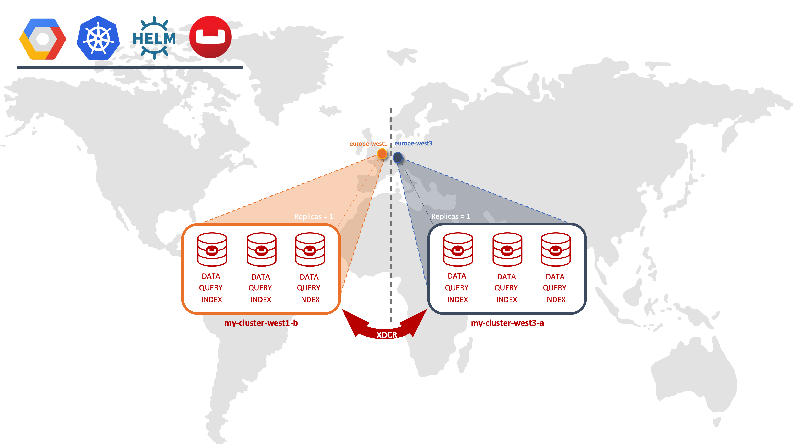
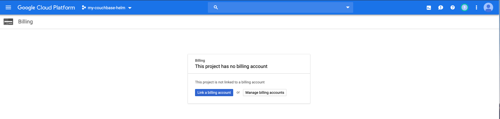
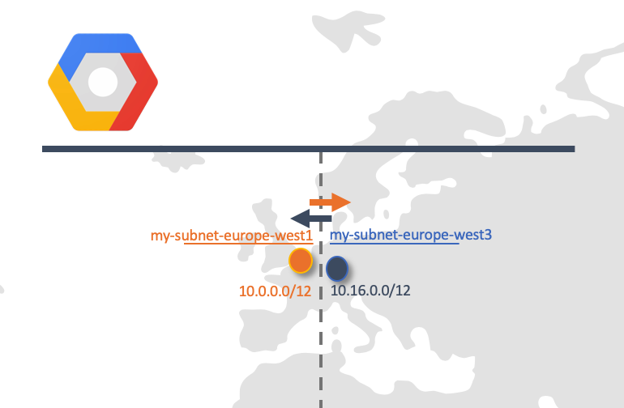
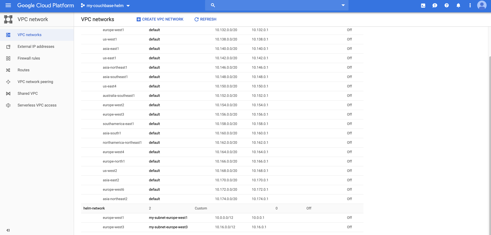
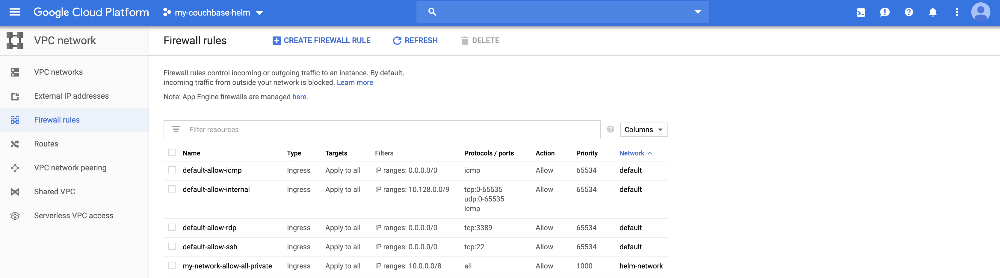
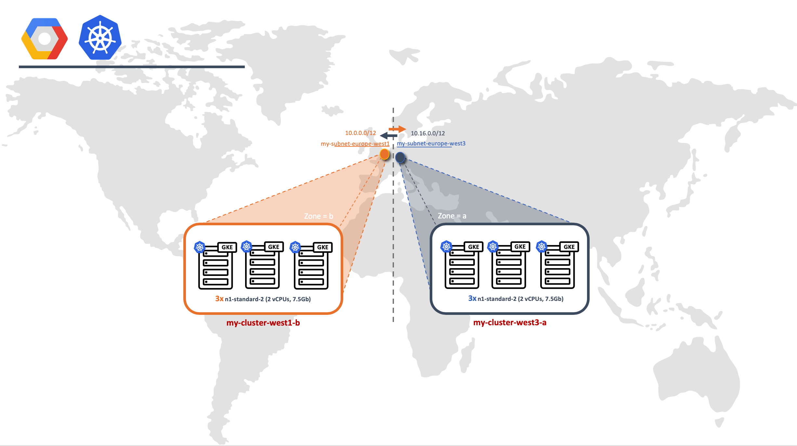
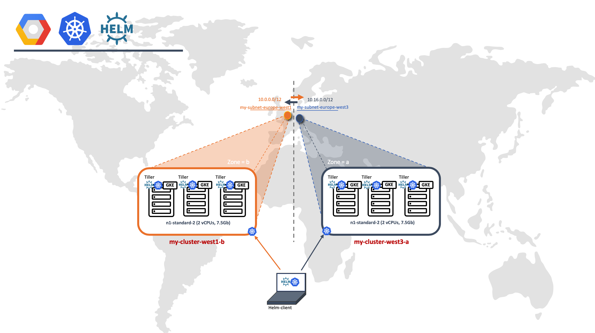
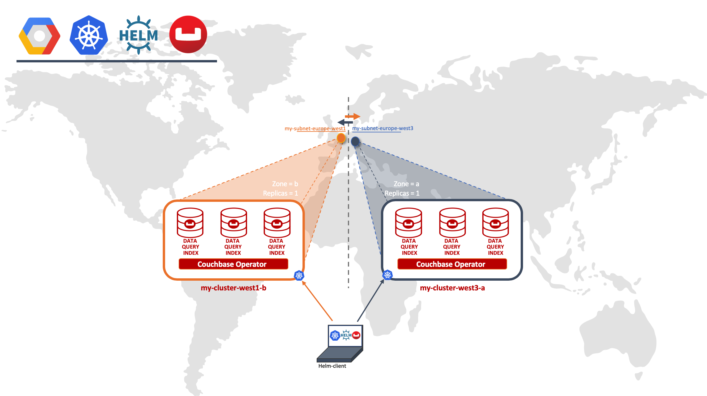
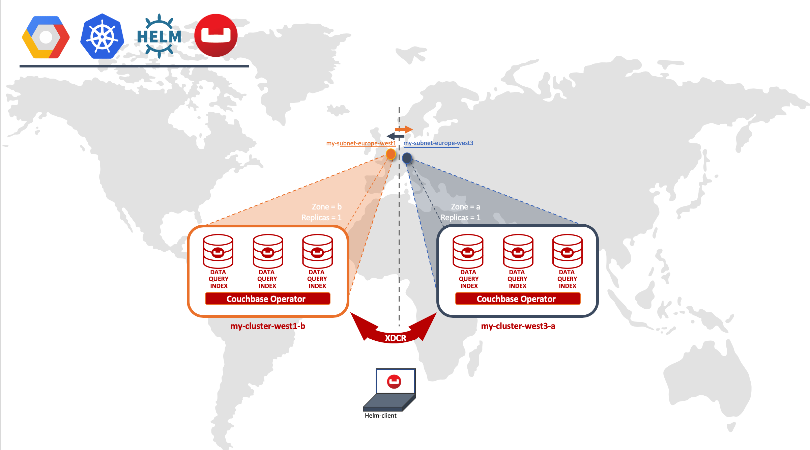

# Couchbase Helm Charts on Google Kubernets Engine (GKE)


## Scope
This page describes how to set up XDCR between two clusters (Active/Pasive or Active/Active) using Helm to properly support the Couchbase Autonomous Operator in GKE environment. 




## Quick Command Steps

```

1. 
2. 
3.
...

```


## What is Helm?
Helm is the package manager for Kubernetes. It is the easiest way to install new applications on your Kubernetes cluster.

This website contains a complete directory of all charts available to install from the official repository. We have grouped them into categories to make browsing for new applications quick and easy.

But how do you actually install them? The first step is to install Helm on your laptop by following this guide.

Make sure you have kubectl working with a valid context pointing to an existing cluster, or local minikube installation, then simply run helm init and it will automatically configure everything required to start installing charts.

Behind the scenes running helm init will install the server side component called Tiller. This all happens magically so you shouldn’t need to do anything.

If you find an application that you’d like to install while browsing this site simply click the visit website button on the listing. You’ll generally find the install command that you can copy and paste into your terminal.


## Prerequisites

1. Google Cloud Account
2. Install [Google Cloud SDK](https://cloud.google.com/sdk/) 
3. Install Kubernetes

## GKE Setup

Like all cloud providers there are two main steps in configuring your cloud environment - the virtual network provisioning then the Kubernetes cluster provisioning.

1. Setup Google SDK
2. Setup Network
3. Setup Cluster

### Google SDK Setup

1. Init Google Cloud SDK 


```
$ gcloud init --console-only
```
**Set you Google Cloud SDK configuration**
Your first time to setup your Google SDK will create the default configuration. Otherwise it will ask you to choose if you want to create a new configuration or reset the current default values. 
 
```
Welcome! This command will take you through the configuration of gcloud.

Your current configuration has been set to: [default]

You can skip diagnostics next time by using the following flag:
  gcloud init --skip-diagnostics

Network diagnostic detects and fixes local network connection issues.
Checking network connection...done.                                                                                                            
Reachability Check passed.
Network diagnostic passed (1/1 checks passed).

You must log in to continue. Would you like to log in (Y/n)?  Y
```

**Log in with your user account**

```
You must log in to continue. Would you like to log in (Y/n)?  Y

Go to the following link in your browser:

    https://accounts.google.com/o/oauth2/auth?redirect_uri=urn%3Aietf%3Awg%3Aoauth%3A2.0%3Aoob&prompt=select_account&response_type=code&client_id=11111945654.apps.googleusercontent.com&scope=https%3A%2F%2Fwww.googleapis.com%2Fauth%2Fuserinfo.email+https%3A%2F%2Fwww.googleapis.com%2Fauth%2Fcloud-platform+https%3A%2F%2Fwww.googleapis.com%2Fauth%2Fappengine.admin+https%3A%2F%2Fwww.googleapis.com%2Fauth%2Fcompute+https%3A%2F%2Fwww.googleapis.com%2Fauth%2Faccounts.reauth&access_type=offline


Enter verification code: 3/WBSSSDEw_phCo1KwrXUsdywps331h9qe-qMVfcfGOZaxkm_ZyXAqapq
You are logged in as: [your.email@domain.com].

Pick cloud project to use: 
 [1] other-project 
 [2] Create a new project
Please enter numeric choice or text value (must exactly match list 
item):  
```

**Create your own project**

```
Pick cloud project to use: 
 [1] other-project 
 [2] Create a new project
Please enter numeric choice or text value (must exactly match list 
item):  2

Enter a Project ID. Note that a Project ID CANNOT be changed later.
Project IDs must be 6-30 characters (lowercase ASCII, digits, or
hyphens) in length and start with a lowercase letter. my-couchbase-helm 
Your current project has been set to: [my-couchbase-helm].

Not setting default zone/region (this feature makes it easier to use
[gcloud compute] by setting an appropriate default value for the
--zone and --region flag).
See https://cloud.google.com/compute/docs/gcloud-compute section on how to set
default compute region and zone manually. If you would like [gcloud init] to be
able to do this for you the next time you run it, make sure the
Compute Engine API is enabled for your project on the
https://console.developers.google.com/apis page.

Your Google Cloud SDK is configured and ready to use!
```


**Associate Billing Account to your project.**

Go to your Google Cloud Platform, select your new project and go to billing tab.



Link your project to your billing account. 

**Note**: Google Cloud Platform offers you a Free Trial of 300\$ during 365 days, it is a great deal.  

2. **Log in**

When the gcloud command has been installed and added to your PATH, log in with the following command:

```
$ gcloud auth login
Your browser has been opened to visit:

    https://accounts.google.com/o/oauth2/auth?redirect_uri=http%3A%2F%2Flocalhost%3A8085%2F&prompt=select_account&response_type=code&client_id=111123402221.apps.googleusercontent.com&scope=https%3A%2F%2Fwww.googleapis.com%2Fauth%2Fuserinfo.email+https%3A%2F%2Fwww.googleapis.com%2Fauth%2Fcloud-platform+https%3A%2F%2Fwww.googleapis.com%2Fauth%2Fappengine.admin+https%3A%2F%2Fwww.googleapis.com%2Fauth%2Fcompute+https%3A%2F%2Fwww.googleapis.com%2Fauth%2Faccounts.reauth&access_type=offline


WARNING: `gcloud auth login` no longer writes application default credentials.
If you need to use ADC, see:
  gcloud auth application-default --help

You are now logged in as [your.email@domain.com].
Your current project is [my-couchbase-helm].  You can change this setting by running:
  $ gcloud config set project PROJECT_ID
```


**Tip:** The gcloud command can support multiple logins. You can select the user to run as with:

```
gcloud config set account your.email@domain.com
```

You can also remove the login authentication locally with:

```
gcloud auth revoke your.email@domain.com
```


3. **Set your default configuration**

Set your default project: 
```
$ gcloud config set project my-couchbase-helm
Updated property [core/project]
```

Set default region: 

```
$ gcloud config set compute/region europe-west3
Updated property [compute/region].
```

Set default zone:
```
$ gcloud config set compute/zone europe-west3-a
Updated property [compute/zone].
```

Check your nearby available region/zones [here](https://cloud.google.com/compute/docs/regions-zones/).


### Setup Network



For the purposes of this document we will manually configure our subnets so we are able to add in the necessary firewall rules to allow [XDCR](https://docs.couchbase.com/operator/1.2/xdcr.html) between Couchbase clusters in different GKE clusters. We create two non-overlapping subnets in the 10.0.0.0/8 [RFC-1918](https://tools.ietf.org/html/rfc1918) private address space in different regions, then allow all ingress traffic from the 10.0.0.0/8 prefix via a firewall rule. By default network traffic is dropped between different GKE clusters.

```  
$ gcloud compute networks create helm-network --subnet-mode custom
Created [https://www.googleapis.com/compute/v1/projects/my-couchbase-helm/global/networks/helm-network].
NAME          SUBNET_MODE  BGP_ROUTING_MODE  IPV4_RANGE  GATEWAY_IPV4
helm-network  CUSTOM       REGIONAL
```

Let's create now the subnet for the first cluster in region europe-west1:

```
$ gcloud compute networks subnets create my-subnet-europe-west1 --network helm-network --region europe-west1 --range 10.0.0.0/12
Created [https://www.googleapis.com/compute/v1/projects/my-couchbase-helm/regions/europe-west1/subnetworks/my-subnet-europe-west1].
NAME                    REGION        NETWORK       RANGE
my-subnet-europe-west1  europe-west1  helm-network  10.0.0.0/12
```

And Subnet for the second cluster in region europe-west3: 

```
$ gcloud compute networks subnets create my-subnet-europe-west3 --network helm-network --region europe-west3 --range 10.16.0.0/12
Created [https://www.googleapis.com/compute/v1/projects/my-couchbase-helm/regions/europe-west3/subnetworks/my-subnet-europe-west3].
NAME                    REGION        NETWORK       RANGE
my-subnet-europe-west3  europe-west3  helm-network  10.16.0.0/12
```



Now we need to configure the firewall rules to enable the communication between both subnets:

```
$ gcloud compute firewall-rules create my-network-allow-all-private --network helm-network --direction INGRESS --source-ranges 10.0.0.0/8 --allow all
Creating firewall...⠛Created [https://www.googleapis.com/compute/v1/projects/my-couchbase-helm/global/firewalls/my-network-allow-all-private].                      
Creating firewall...done.                                                                                                                                           
NAME                          NETWORK       DIRECTION  PRIORITY  ALLOW  DENY  DISABLED
my-network-allow-all-private  helm-network  INGRESS    1000      all          False
```



### Provisioning Instances for the Kubernetes-Helm Cluster


1. **Check your cluster version per region/zone**

You can check which Kubernetes versions are available and default in a given zone from [Google Cloud Platform Console](https://cloud.google.com/kubernetes-engine/versioning-and-upgrades) or by using the gcloud command-line tool.

```
$ gcloud container get-server-config --zone europe-west3-a
Fetching server config for europe-west3-a
defaultClusterVersion: 1.12.7-gke.10
defaultImageType: COS
validImageTypes:
- COS_CONTAINERD
- COS
- UBUNTU
validMasterVersions:
- 1.13.6-gke.0
- 1.13.5-gke.10
- 1.12.7-gke.17
- 1.12.7-gke.10
- 1.12.6-gke.11
- 1.11.9-gke.13
- 1.11.9-gke.8
- 1.11.8-gke.6
validNodeVersions:
- 1.13.6-gke.0
- 1.13.5-gke.10
- 1.12.7-gke.17
- 1.12.7-gke.10
- 1.12.7-gke.7
...
- 1.7.12-gke.2
- 1.6.13-gke.1
```


2. **Check [Google cloud machine types](https://cloud.google.com/compute/docs/machine-types)**

A machine type specifies a particular collection of virtualized hardware resources available to a virtual machine (VM) instance, including the system memory size, virtual CPU (vCPU) count, and maximum persistent disk capability.

```
gcloud compute machine-types list
```

**Note:** Trial Google Account is limited to 12 vCPUs. In the context of this example, we will choose **n1-standar-2** (2 vCPUs, RAM 7.5Gb). Choose the right instance size for hosting Couchbase Server. Please check the [Couchbase sizing guidelines](https://docs.couchbase.com/server/current/install/sizing-general.html) and the best practices with [Multidimensional Scaling (MDS)](https://docs.couchbase.com/server/current/clustersetup/services-mds.html) to properly sizing your project and/or contact Couchbase Professional Services. 


3. **Create instances for Cluster 1 in europe-west1 zone b**

```
$ gcloud container clusters create my-cluster-europe-west1-b --machine-type n1-standard-2 --cluster-version 1.13.6-gke.0 --zone europe-west1-b --network helm-network --subnetwork my-subnet-europe-west1 --num-nodes 3

...

To inspect the contents of your cluster, go to: https://console.cloud.google.com/kubernetes/workload\_/gcloud/europe-west1-b/my-cluster-europe-west1-b?project=my-couchbase-helm
kubeconfig entry generated for my-cluster-europe-west1-b.
NAME                       LOCATION        MASTER_VERSION  MASTER_IP      MACHINE_TYPE   NODE_VERSION  NUM_NODES  STATUS
my-cluster-europe-west1-b  europe-west1-b  1.13.6-gke.0    35.187.73.153  n1-standard-2  1.13.6-gke.0  3          RUNNING
```


4. **Create instances for cluster 2 in europe-west3 zone a**

```
$ gcloud container clusters create my-cluster-europe-west3-a --machine-type n1-standard-2 --cluster-version 1.13.6-gke.0 --zone europe-west3-a --network helm-network --subnetwork my-subnet-europe-west3 --num-nodes 3

...

kubeconfig entry generated for my-cluster-europe-west3-a.
NAME                       LOCATION        MASTER_VERSION  MASTER_IP      MACHINE_TYPE   NODE_VERSION  NUM_NODES  STATUS
my-cluster-europe-west3-a  europe-west3-a  1.13.6-gke.0    35.234.69.209  n1-standard-2  1.13.6-gke.0  3          RUNNING
```

5. **List Clusters**

```
$ gcloud container clusters list
NAME                       LOCATION        MASTER_VERSION  MASTER_IP      MACHINE_TYPE   NODE_VERSION  NUM_NODES  STATUS
my-cluster-europe-west1-b  europe-west1-b  1.13.6-gke.0    35.187.73.153  n1-standard-2  1.13.6-gke.0  3          RUNNING
my-cluster-europe-west3-a  europe-west3-a  1.13.6-gke.0    35.234.69.209  n1-standard-2  1.13.6-gke.0  3          RUNNING
```

6. **Get Credentials**
When the clusters are running (the gcloud command will block and complete when the clusters are healthy) you can install credentials into your Kubernetes configuration with the following:

Credentials from **my-cluster-europe-west1-b** Cluster

```
gcloud container clusters get-credentials my-cluster-europe-west1-b --zone europe-west1-b --project helmchart
Fetching cluster endpoint and auth data.
kubeconfig entry generated for my-cluster-europe-west1-b.
```

Credentials from **my-cluster-europe-west3-a** Cluster 

```
$ gcloud container clusters get-credentials my-cluster-europe-west3-a --zone europe-west3-a --project helmchart
Fetching cluster endpoint and auth data.
kubeconfig entry generated for my-cluster-europe-west3-a.
```


## Deploying Couchbase Operator and Server with Helm charts


### Kubernetes environment Setup

```
$ kubectl create clusterrolebinding your-admin-binding --clusterrole cluster-admin --user $(gcloud config get-value account)
clusterrolebinding.rbac.authorization.k8s.io/jose-molina-admin-binding created
```


### Setup Helm



Setting up Helm consists of installing the Helm client (**helm**) on your computer, and installing the Helm server (Tiller) on your Kubernetes or OpenShift cluster. Once you’ve set up Helm, you can then use official Couchbase Helm charts to deploy the Operator and the Couchbase Server cluster.

1. [Install helm client](https://helm.sh/docs/using_helm/#installing-helm) on your local machine. 


2. Installing Helm Server (Tiller) for development

For development use-cases, the Tiller service can be given access to deploy charts into any namespace of your Kubernetes cluster. This also means that resources created by the chart, such as the custom resource definition (CRD), are allowed when Tiller is given this level of privilege.

To create RBAC rules for Tiller with cluster-wide access create the following ServiceAccount and save to rbac-tiller.yaml:

```
$ nano rbac-tiller-development.yaml
```

```
apiVersion: v1
kind: ServiceAccount
metadata:
  name: tiller
  namespace: kube-system
---
apiVersion: rbac.authorization.k8s.io/v1
kind: ClusterRoleBinding
metadata:
  name: tiller
roleRef:
  apiGroup: rbac.authorization.k8s.io
  kind: ClusterRole
  name: cluster-admin
subjects:
  - kind: ServiceAccount
    name: tiller
    namespace: kube-system
```


* **my-cluster-europe-west1-b** Cluster

**Get Credentials**

```
gcloud container clusters get-credentials my-cluster-europe-west1-b --zone europe-west1-b --project helmchart
Fetching cluster endpoint and auth data.
kubeconfig entry generated for my-cluster-europe-west1-b.
```

**Create Service Account**

```
$ kubectl create -f rbac-tiller-development.yaml 
serviceaccount/tiller created
clusterrolebinding.rbac.authorization.k8s.io/tiller created
```


**Initialize Helm**

```
$ helm init --service-account tiller
$HELM_HOME has been configured at /Users/username/.helm.
Tiller (the Helm server-side component) has been installed into your Kubernetes Cluster.

Please note: by default, Tiller is deployed with an insecure 'allow unauthenticated users' policy.
To prevent this, run `helm init` with the --tiller-tls-verify flag.
For more information on securing your installation see: https://docs.helm.sh/using_helm/#securing-your-helm-installation
```

* **my-cluster-europe-west3-a** Cluster 

**Get Credentials**

```
$ gcloud container clusters get-credentials my-cluster-europe-west3-a --zone europe-west3-a --project helmchart
Fetching cluster endpoint and auth data.
kubeconfig entry generated for my-cluster-europe-west3-a.
```


**Create Service Account**

```
$ kubectl create -f rbac-tiller-development.yaml 
serviceaccount/tiller created
clusterrolebinding.rbac.authorization.k8s.io/tiller created
```


**Initialize Helm**

```
$ helm init --service-account tiller
```
 
Referenced Links: 

* [Installing Tiller official Steps](https://docs.helm.sh/using_helm/#installing-tiller) 
* [Couchbase Helm Setup](https://docs.couchbase.com/operator/current/helm-setup-guide.html)

--- 

* **Add the chart repository to helm**

```
helm repo add couchbase https://couchbase-partners.github.io/helm-charts/
```


### Deploy Couchbase Operator
Two [Helm charts](https://docs.helm.sh/using_helm/#three-big-concepts) are available for deploying Couchbase. The [Couchbase Operator Chart](https://docs.couchbase.com/operator/current/helm-operator-config.html) deploys the [admission controller](https://docs.couchbase.com/operator/current/install-admission-controller.html) and the Operator itself. The [Couchbase Cluster Chart](https://docs.couchbase.com/operator/current/helm-cluster-config.html) deploys the Couchbase Server cluster.

For production deployments, you’ll only use the Operator Chart. For development environments, the Couchbase Cluster Chart is available to help you quickly set up a test cluster.


1. Add the chart repository to helm:
```
helm repo add couchbase https://couchbase-partners.github.io/helm-charts/
```

2. Install the operator chart

```
$ helm install couchbase/couchbase-operator
```


### Deploy Couchbase Server Cluster



On this document, we will modify the default helm chart to config the cluster to deploy into myvalues-clustercfg.yaml file. 

```
couchbaseCluster:
  version: "enterprise-6.0.1"
  cluster:
    indexStorageSetting: plasma
    autoFailoverTimeout: 30
    autoFailoverMaxCount: 3
    autoFailoverOnDataDiskIssues: true
    autoFailoverOnDataDiskIssuesTimePeriod: 30
  buckets:
    default:
      name: demo
      type: couchbase
      memoryQuota: 128
      replicas: 1
      ioPriority: high
      evictionPolicy: valueOnly
      conflictResolution: seqno
      enableFlush: true
      enableIndexReplica: false
  servers:
    all_services:
      size: 3
      services:
        - data
        - index
        - query
```

This file will override the default bucket name (demo), its evictionPolicy (valueOnly) and the default services (data, index, query)

Let's deploy it with helm into each cluster:

* **my-cluster-europe-west1-b** Cluster 

**Get Credentials**

```
$ gcloud container clusters get-credentials my-cluster-europe-west1-b --zone europe-west1-b --project helmchart
Fetching cluster endpoint and auth data.
kubeconfig entry generated for my-cluster-europe-west1-b.
```

**helm install**

```
$ helm install --values myvalues-clustercfg.yaml --set couchbaseCluster.name=my-cluster-west1b couchbase/couchbase-cluster
```

* **my-cluster-europe-west3-a** Cluster 

**Get Credentials**

```
$ gcloud container clusters get-credentials my-cluster-europe-west3-a --zone europe-west3-a --project helmchart
Fetching cluster endpoint and auth data.
kubeconfig entry generated for my-cluster-europe-west3-a.
```

**helm install**

```
$ helm install --values myvalues-clustercfg.yaml --set couchbaseCluster.name=my-cluster-west3a couchbase/couchbase-cluster
```

## Config XDCR



falling-bird-couchbase-cluster-0000.falling-bird-couchbase-cluster.default.svc

```
$ kubectl get pods
NAME                                                              READY   STATUS    RESTARTS   AGE
intentional-shrimp-couchbase-cluster-0000                         1/1     Running   0          115m
intentional-shrimp-couchbase-cluster-0001                         1/1     Running   0          114m
intentional-shrimp-couchbase-cluster-0002                         1/1     Running   0          114m
wizened-wolverine-couchbase-admission-controller-7f9b8d4d8b2btt   1/1     Running   0          117m
wizened-wolverine-couchbase-operator-698554dbb-hfrkm              1/1     Running   0          117m
```

```
$ kubectl get pod intentional-shrimp-couchbase-cluster-0000 -o yaml | grep hostIP
  hostIP: 10.0.0.7
```

```
$ kubectl get service intentional-shrimp-couchbase-cluster-0000-exposed-ports
NAME                                                      TYPE       CLUSTER-IP     EXTERNAL-IP   PORT(S)                                                                                         AGE
intentional-shrimp-couchbase-cluster-0000-exposed-ports   NodePort   10.59.250.69   <none>        8091:30768/TCP,18091:31941/TCP,8092:31558/TCP,18092:30769/TCP,11210:30014/TCP,11207:30862/TCP   115m
```


